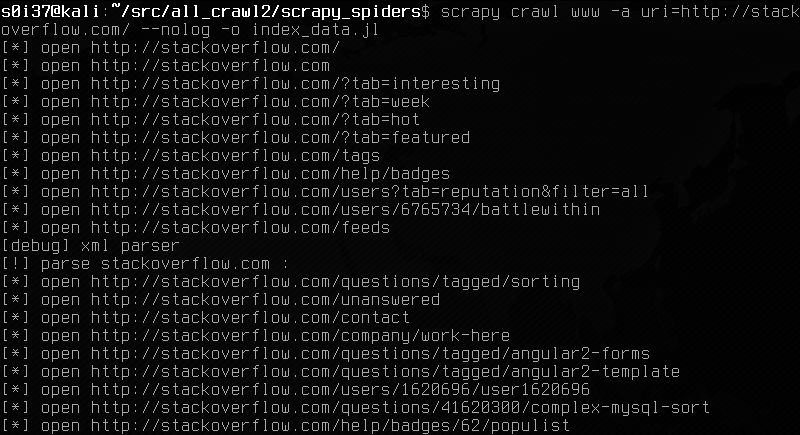
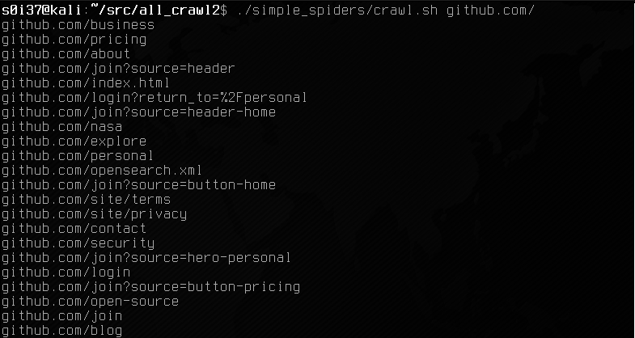
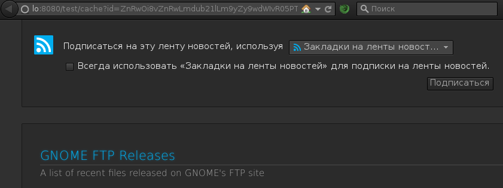

#**all_crawl**
##*spiders*
require:

* *(optional) apt-get install redis-server*  #(scrapy spiders queue implementation)

* *(optional) apt-get install tesseract-ocr*  #(text recognize)

* *apt-get install catdoc*  #(.doc and .xls files - simple spiders)

* *apt-get install python-pdfminer* 	#(.pdf files - simple spiders)

* *apt-get install radare2* 	#(get strings from executable - simple spiders)

* *apt-get install 7z* 	#(archive files - simple spiders)

* *apt-get install lynx*  #(.html files - simple spiders)

* *apt-get install xdg-utils*  #(mimetypes - simple spiders)

* *elasticsearch*  #(search machine)

* */path/to/elasticsearch/elasticsearch-plugin install http://dl.bintray.com/content/imotov/elasticsearch-plugins/org/elasticsearch/elasticsearch-analysis-morphology/5.4.0/elasticsearch-analysis-morphology-5.4.0.zip* (for russian morphology)

* *pip install -r requirements.txt*

* *cd search && npm install*  #(web interface)

*scrapy spiders* supported follow schemes: ftp:// http:// and smb://

*simple spiders* supported ftp:// and http:// schemes and samba (smbmount)

and parsers: plaintext, xml, http, doc(x), xls(x), http, pdf, images, ziparchives, executable and raw

###www crawl (scrapy)

`cd scrapy_spiders`

`scrapy crawl www -a uri=http://www.site.com/ --nolog -o index_data.jl`

or (without redis)

`scrapy crawl www -a uri=http://www.site.com/ --nolog -o index_data.jl -s JOBDIR=site_crawl`

As a result of crawling data will be stored in a .js-file (one json object per line).

continue crawling:

`scrapy crawl www -a zone=www.site.com --nolog -o index_data.jl`

or (without redis)

`scrapy crawl www -a uri=http://www.site.com/ --nolog -o index_data.jl -s JOBDIR=site_crawl`

If all is implemented in an integrated scrapy mechanism, rather than stored in redis, to be able to resume crawling, you must explicitly specify the name of the stored session (JOBDIR parameter)

`scrapy crawl www -a uri=http://www.site.com/ --nolog -a elastic_uri=localhost:9200 -a elastic_index=someindex`

The same data can be send directly to a search engine bypassing .jl-files. This scenario is useful for distributed crawling.

All data collected will later be available through:

`http://localhost:8080/someindex/`

###ftp crawl (scrapy)

Unstable!

Similarly, you can index the content ftp-resources:

`scrapy crawl ftp -a uri=ftp://site.com/pub/ --nolog -o data.jl`

###www/ftp crawl (bash)

Lightweight and portable variant.

Identical functionality for crawling sites as presented in two bash-scripts spider.sh and crawl.sh.

Scripts are wrappers around the GNU-utilities `wget` and `find` respectively. These utilities have a powerful engine and reliable enough to use.

(only one site per spider)

`cd ..`

`./simple_spiders/spider.sh http://www.site.com/`

or

`./simple_spiders/spider.sh ftp://ftp.site.com/pub/`

At this stage, the simple preservation of the site's structure and its contents. It is worth remembering that wget also maintains a list of directories and ignore the extensions.

www/ftp crawling with `wget` tool

In the event of renewed crawling, wget will not only load previously downloaded content (in the case if the server reports the file modification time).

Now you need to alternately obtain the contents of each saved file and parse it in accordance with its mimetype.

`./simple_spiders/crawl.sh www.site.com`

In the end of each file will be extracted most useful text information. All information is stored in a single text file (for dns-name of the site).

`python simple_spiders/import.py www.site.com.txt localhost:9200`

With the optional python-script you import into a search engine for easy and powerful search.

Note, that imports elasticsearch optional. All collected information is stored in a text file. So to find the required data, you can use all the power gnu-utilities, for example grep / egrep. Thus, the search for specific information, such as passwords, all the search facility can be represented by just two scripts - spider.sh and crawl.sh (without scrapy and elasticsearch)

###smb crawl (scrapy)

Unstable!

`cd scrapy_spiders`

`scrapy crawl smb -a uri=smb://192.168.0.12/public/ -a domain=smbdomain -a user=smbuser -a password=smbpass --nolog -a elastic_uri=localhost:9200`

or

`scrapy crawl smb -a uri=smb://192.168.0.12/public/ -a domain=smbdomain -a user=smbuser -a password=smbpass --nolog -o index_data.jl`

###smb crawl (bash)

Smb-crawling resources occurs without spider.sh. Only crawl.sh.

`mount -t cifs -o dom=domain,user=username //ip/share /mnt/share`
`./simple_spiders/crawl.sh /mnt/share`

local crawling with `find` tool

`./simple_spiders/crawl.sh /mnt/share`

crawl.sh also supports the resumption of crawling using the session files (.somedomain.sess files).

`python simple_spiders/import.py share.txt localhost:9200`

import crawl data in search machine (elasticsearch)

##*index*
###import crawl data in search machine (elasticsearch)

Elasticsearch stored data in the form:
* Index (arbitrary name)
* Type of document (page in this case)
* Collector (intext, intitle, inurl, site, ext, filetype)
The search query is processed within a certain index, such as:

`python search_tool.py -import data.jl localhost:9200`

"Default" will be inserted in this case. Or:

`python search_tool.py -import data.jl -i someindex localhost:9200`

The data stored in the specified index "someindex".

import jsonlines crawled data

Note, that this method of importing data into a search engine is only suitable for the data received from scrapy spiders.

###manage indexes

elasitcsearch controlled by various http-requests in RESTapi-style.

But for ease of use, number of primitive operations concluded in the utility.

show indexes:

`python search_tool.py localhost:9200`

drop index:

`python search_tool.py -drop -i someindex localhost:9200`

stop index:

`python search_tool.py -stop -i someindex localhost:9200`

start index:

`python search_tool.py -start -i someindex localhost:9200`

backup index:

`python search_tool.py localhost:9200 -backup indexbak -i someindex`

restore index:

`python search_tool.py localhost:9200 -restore indexbak`

settings index. Set the default document type "page" with collectors (intext, intitle, inurl, site, ext, filetype):

`python search_tool.py localhost:9200 -settings -i someindex`

###enable autocomplete

`python search_tool.py -stop -i someindex localhost:9200`

`python search_tool.py -autocomplete -i someindex localhost:9200`

`python search_tool.py -start -i someindex localhost:9200`

Note, that the inclusion of an additional autocompletion starts the analysis of the data stored in the index. If the number of large documents - including mode will take a lot of time and very CPU intensive operation.

###cli query

elasticsearch itself does not possess any interface to search / retrieve data except special of http-requests. Therefore, two simple search interface has been developed - the console and graphical(next paragraph):

`python search_tool.py localhost:9200 -query some query`

or

`python search_tool.py localhost:9200 -i someindex -query some query`

offset and limit results:

`python search_tool.py localhost:9200 -o 10 -c 5 -query some query`

##*search*

`cd search`

`nodejs index.js`

It is worth to remember about indexes. Data can be stored in isolated indexes. The index name is specified as the first directory in the path URN:

http://localhost:8080/someindex/

or default

http://localhost:8080/

search query as google-like syntax, example:

"site:site.com intext:odbc ext:exe"

view cache (click green uri)

