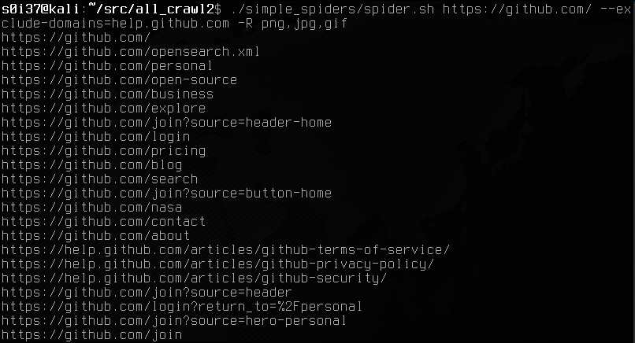
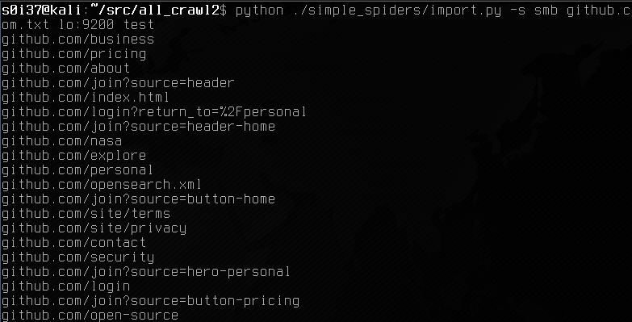
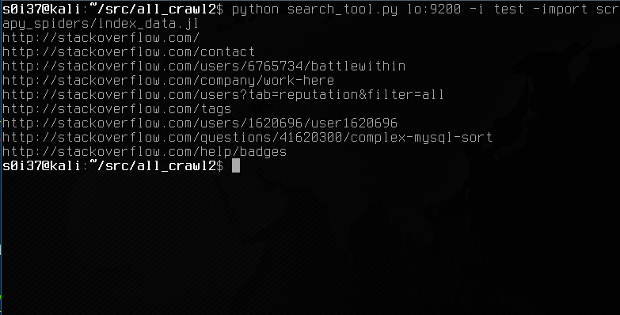
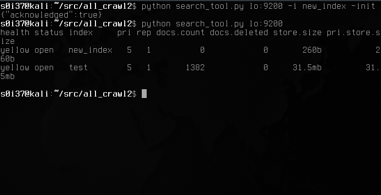
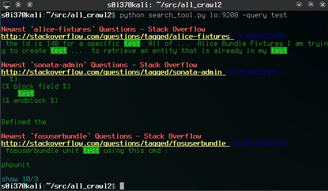
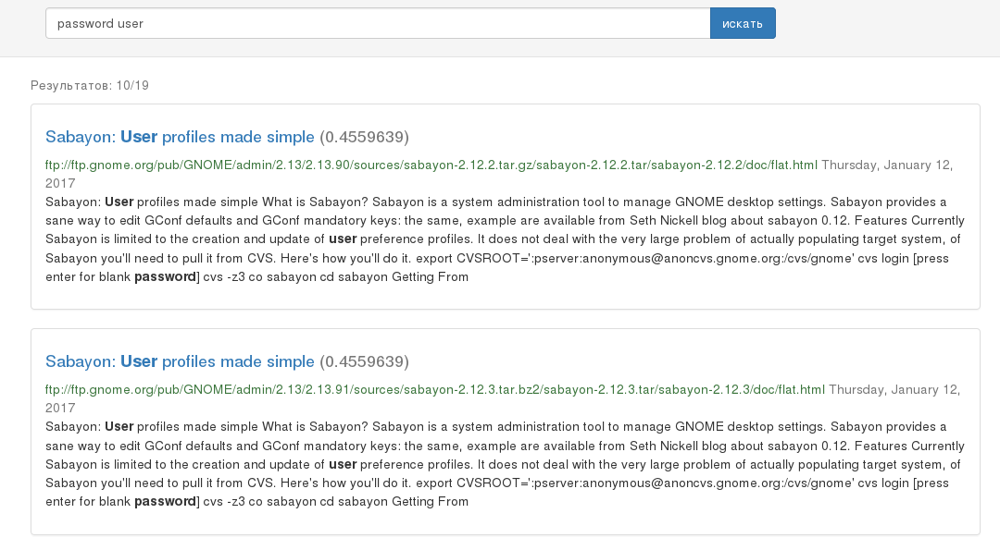

#**all_crawl**
##*spiders*
Зависимости:

* *apt-get install redis-server*  #(scrapy spiders реализация очереди) (optional)

* *apt-get install tesseract-ocr*  #(распознование текста в изображениях) (optional)

* *apt-get install catdoc*  #(.doc files - simple spiders)

* *apt-get install xls2csv* 	#(.xls files - simple spiders)

* *apt-get install pdf2text* 	#(.pdf files - simple spiders)

* *apt-get install radare2* 	#(get strings from executable - simple spiders)

* *apt-get install 7z* 	#(archive files - simple spiders)

* *apt-get install lynx*  #(.html files - simple spiders)

* *apt-get install xdg-utils*  #(mimetypes - simple spiders)

* *elasticsearch*  #(search machine) (needed)

* *pip install -r requirements.txt*

* *cd search && npm install*  #(web interface)

*scrapy spiders* поддерживают следующие схемы: ftp:// http:// and smb://
*simple spiders* поддерживает ftp:// and http:// schemes и samba (через smbmount)
и парсеры: plaintext, xml, http, doc(x), xls(x), http, pdf, images, ziparchives, executable and raw

###www краулинг (scrapy)

`cd scrapy_spiders`

`scrapy crawl www -a uri=http://www.site.com/ --nolog -o index_data.jl`

или (без redis)

`scrapy crawl www -a uri=http://www.site.com/ --nolog -o index_data.jl -s JOBDIR=site_crawl`

В результате краулинга данные будут сохранены в .js-файл (one json object per line).

Возобновление краулинга:

`scrapy crawl www -a zone=www.site.com --nolog -o index_data.jl`

или (без redis)

`scrapy crawl www -a uri=http://www.site.com/ --nolog -o index_data.jl -s JOBDIR=site_crawl`

В случае, если очередь реализуется встроенным в scrapy механизмом, а не хранится в redis, для возможности возобновить краулинг необходимо явно указать, имя сохраняемой сессии (параметр JOBDIR)

`scrapy crawl www -a uri=http://www.site.com/ --nolog -a elastic_uri=localhost:9200 -a elastic_index=someindex`

Так же данные можно напрямую засылать в поисковую машину минуя .jl-файлы. Такой сценарий удобен для распределенного краулинга.

Все собранные данные позже будут доступны через:

`http://localhost:8080/someindex/`

###ftp краулинг (scrapy)

Unstable!

Аналогично можно индексировать контент ftp-ресурсов:

`scrapy crawl ftp -a uri=ftp://site.com/pub/ --nolog -o data.jl`

###www/ftp краулинг (bash)

Легковесный и переносимый вариант.

Идентичный функционал по краулингу сайтов так же представлен в двух bash-скриптах spider.sh и crawl.sh.

Скрипты являются обертками вокруг gnu-утилит wget и find соответственно. Данные утилиты обладают мощным движком и достаточно надёжны в использовании.

(только один сайт на один запуск spider.sh)

`cd ..`

`./simple_spiders/spider.sh http://www.site.com/`

или

`./simple_spiders/spider.sh ftp://ftp.site.com/pub/`

На данном этапе происходит простое сохранение структуры сайта с его содержимым. Стоит помнить, что wget так же поддерживает список игнорируемых каталогов и расширений.

www/ftp краулинг с помощью утилиты `wget`

В случае возобновления краулинга, wget будет загружать только не скачанный ранее контент (в случае если сервер сообщает время изменения файла).

Теперь необходимо поочерёдно получить содержимое каждого сохранённого файла и распарсить его в соответствии с его mimetype.

`./simple_spiders/crawl.sh www.site.com`

В итоге из каждого файла будет извекаться максимально полезная текстовая информация. Вся информация сохраняется в один текстовый файл (по dns-имени сайта).

`python simple_spiders/import.py www.site.com.txt localhost:9200`

С помощью дополнительного python-скрипта выполнен импорт в поисковую машину для удобного и мощного поиска.

Стоит заметить, что импорт в elasticsearch необязателен. Вся собранная информация хранится в одном текстовом файле. А значит для поиска необходимых данных можно воспользоваться всей мощью gnu-утилит, например grep/egrep. Таким образом, для поска конкретной информации, например паролей, весь поисковый механизм может быть представлен лишь двумя скриптами spider.sh и crawl.sh (без scrapy и elasticsearch)

###smb краулинг (scrapy)

Experimental!

`cd scrapy_spiders`

`scrapy crawl smb -a uri=smb://192.168.0.12/public/ -a domain=smbdomain -a user=smbuser -a password=smbpass --nolog -a elastic_uri=localhost:9200`

или

`scrapy crawl smb -a uri=smb://192.168.0.12/public/ -a domain=smbdomain -a user=smbuser -a password=smbpass --nolog -o index_data.jl`

###smb краулинг (bash)

Краулинг smb-ресурсов происходит без участия spider.sh. Только crawl.sh.

`mount -t cifs -o dom=domain,user=username //ip/share /mnt/share`
`./simple_spiders/crawl.sh /mnt/share`

локальный краулинг с помощью утилиты `find`

`./simple_spiders/crawl.sh /mnt/share`

crawl.sh так же поддерживает возобновление краулинга с помощью файлов сессии (.somedomain.sess files).

`python simple_spiders/import.py share.txt localhost:9200`

импорт данных в поисковую машину (elasticsearch)

##*index*
###импорт данных в поисковую машину (elasticsearch)

Данные в elasticsearch хранятся в виде:
* индекс (произвольное имя)
* тип документа (page в данном случае)
* коллектор (intext,intitle,inurl,site,ext,filetype)
Поисковый запрос обрабатывается в пределах определённого индекса, например:

`python search_tool.py -import data.jl localhost:9200`

в данном случае будет подставлено "default". Или 

`python search_tool.py -import data.jl -i someindex localhost:9200`

Данные сохранятся в заданный индекс "someindex".

импорт jsonlines данных

Стоит отметить, что данный метод импорта данных в поисковую машину годится только для данных полученных от scrapy spiders

###управление индексами

elasitcsearch управляется различными http-запросами с json-данными в RESTapi-стиле.

Но для простоты использования ряд примитивных операций заключены в данной утилите.

список индексов:

`python search_tool.py localhost:9200`

удалить индекс:

`python search_tool.py -drop -i someindex localhost:9200`

остановить индекс:

`python search_tool.py -stop -i someindex localhost:9200`

запустить индекс:

`python search_tool.py -start -i someindex localhost:9200`

резервная копия индекса:

`python search_tool.py localhost:9200 -backup indexbak -i someindex`

восстановление индекса:

`python search_tool.py localhost:9200 -restore indexbak`

настройка индекса. Установка дефолтного типа документа "page" с коллекторами (intext,intitle,inurl,site,ext,filetype):

`python search_tool.py localhost:9200 -settings -i someindex`

###включение автодополнения

`python search_tool.py -stop -i someindex localhost:9200`

`python search_tool.py -autocomplete -i someindex localhost:9200`

`python search_tool.py -start -i someindex localhost:9200`

Стоит иметь ввиду, что включение автодополнения запускает дополнительный анализ данных, хранящихся в индексе. В случае если количество документов велико - включение режиме займёт достаточно много времени и сильно нагрузит процессор.

###cli query

elasticsearch сам по себе не обладает каким либо интерфейсом для поиска/получения данных кроме специальных http-запросов. Поэтому было разработано два простых поисковых интерфейса - консольный и графический (ниже)

`python search_tool.py localhost:9200 -query some query`

или

`python search_tool.py localhost:9200 -i someindex -query some query`

смещение и количество выводимых результатов:

`python search_tool.py localhost:9200 -o 10 -c 5 -query some query`

##*search*

`cd search`

`nodejs index.js`

Тут стоит вспомнить про индексы. Данные можно хранить в изолированных индексах. Имя индекса задается как первый каталог пути в URN:

~http://localhost:8080/someindex/~

или default

~http://localhost:8080/~

поисковый синтаксис выполнен в google-like стиле, например:

"site:site.com intext:odbc ext:exe"

Так же возможны запросы с подстановками, если требуется найти слово с разными окончаниями

